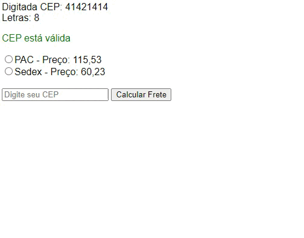

## Calculando Frete 

### Calculando frete com PHP, XML e HTML 

## Referências:
[[TUTORIAL] Calcular valor do frete Correios PAC ou SEDEX com PHP](https://www.youtube.com/watch?v=0e4xRupfoFQ&t=72s) - Zero Bugs
  
[Correios Web Services - CWS](https://cws.correios.com.br/)  

[API Consulta CEP (1.0.2)](https://www.gov.br/conecta/catalogo/apis/cep-codigo-de-enderecamento-postal/swagger-json/swagger_view)

